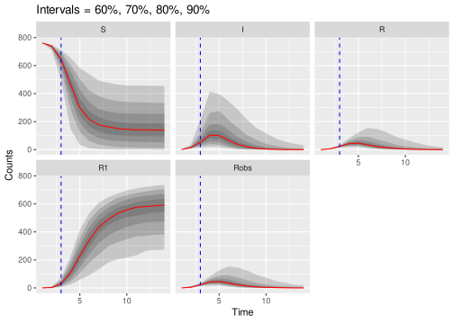
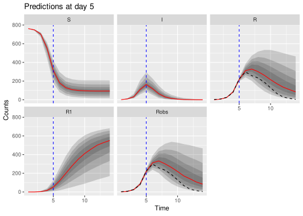
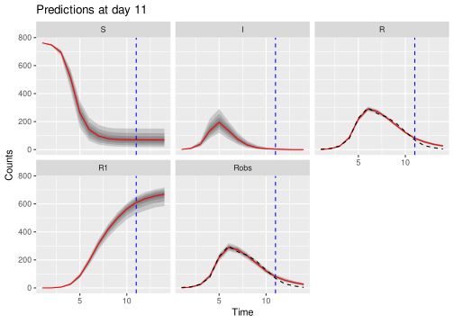

--- 
title: "Inference in infectious disease systems practicals"
author: "[TJ McKinley](mailto:t.mckinley@exeter.ac.uk)"
site: bookdown::bookdown_site
output:
    bookdown::pdf_book:
        latex_engine: xelatex
        includes:
            in_header: header.tex
    bookdown::gitbook:
        config:
            sharing: null
        css: 'style.css'
        includes:
            in_header: _toggle.html
        keep_md: TRUE
linkcolor: blue
documentclass: book
bibliography: ref.bib
link-citations: yes
description: "Inference in infectious disease systems practicals"
---

# Introduction


The purpose of this document is to run some ABC-SMC routines using the (current) [`SimBIID`](https://github.com/tjmckinley/SimBIID) package (Simulation-Based Inference for Infectious Disease models), which is a package designed mostly for teaching purposes, to illustrate some of the ideas and routines discussed in the lectures.

> **Please note that there is a PDF version of these notes available by clicking on the icon in the top-left corner of the page.**

I am heavily indebted to [Stefan Widgren](http://www.it.uu.se/katalog/stewi333) for his fantastic [SimInf](https://cran.r-project.org/web/packages/SimInf/index.html) package, and indeed (with permission) I shamelessly borrow some of his ideas (such as the `mparse()` function).

In the longer term, it would be good to have a fully `SimInf` supported version of this package, but for the time being I have developed `SimBIID` mostly as a tool to help you learn how ABC-SMC (and other routines) work, and to allow you to get your hands dirty with some real models/data, but without the complexities of having to code these routines up yourselves.

There are various general-purpose software packages for performing Bayesian inference for general classes of models. For example, 

* [WinBUGS](https://www.mrc-bsu.cam.ac.uk/software/bugs/the-bugs-project-winbugs/)
* [JAGS](http://mcmc-jags.sourceforge.net/)
* [Stan](https://mc-stan.org/)

For general-purpose Bayesian modelling, with tractable likelihood functions, then I would recommend any of these packages. However, the problem from the infectious disease modelling perspective is that it is challenging to implement the kinds of models that we use in this course, particularly when we have missing or incomplete data, and non-standard likelihoods. An R package that is designed for modelling the kinds of system we focus on in this course is [`pomp`](https://kingaa.github.io/pomp/) (standing for Partially Observed Markov Processes). This a powerful package that can be used to implement various "plug-and-play" inference algorithms, notably the maximum likelihood via iterated filtering (MIF) approach of @ionidesetal:2006, and a particle Markov chain Monte Carlo algorithm [@andrieuetal:2010] based on the bootstrap particle filter [@gordonetal:1993]. It also includes some simple Approximate Bayesian Computation rejection algorithms, but not the more powerful ABC-SMC approach of @tonietal:2009. `pomp` also provides functions to efficiently simulate from state-space models. The interface is more complex than `SimInf` and `SimBIID` (it involves you knowing some small amount of C), and so for the purposes of this course the `SimBIID` package will serve as an entry point into these algorithms. There are also some general purpose ABC packages in R, such as the [`EasyABC`](https://cran.r-project.org/web/packages/EasyABC/index.html) package. 

The `pomp` website: [https://kingaa.github.io/pomp/](https://kingaa.github.io/pomp/)---on [Aaron King's](https://lsa.umich.edu/eeb/people/faculty/kingaa.html) GitHub page---contains lots of tutorials for those of you who wish to pursue any of these ideas further. The influenza in a boarding school data [@anonymous:1978] that we will use as a case study can be found in the [`outbreaks`](http://www.repidemicsconsortium.org/outbreaks/index.html) R package, attributed to @devriesetal:2006, although variations of the data can be found in other literature [e.g. @murray:2003] and is also used in some of the `pomp` tutorials. The Abakaliki smallpox data can also be found in the `outbreaks` package, as well as in other places in the literature [e.g. @oneill_roberts:1999; @mckinleyetal:2014].

The workhorse of `SimBIID` is the function `mparseRcpp()`, which apes the syntax of `mparse()`, but allows for different compilation and output options. It does not have the full power of `SimInf`, so currently only works on single node simulations (no networks), with some limited additional structures. It also implements a simple Gillespie algorithm, rather than the more sophisticated approaches used in `SimInf` and `pomp`, but it's fast enough for the examples here. It also allows for other things such as the inclusion of early stopping criteria, which often greatly help to improve efficiency in say ABC-SMC routines (particularly in poorly supported regions of the parameter space).

## Installation

The package depends on the `Rcpp` and `RcppArmadillo` packages, which require the installation of the correct C++ compilers. The guidance below is taken from Sections 2.1.1, 2.1.2 or 2.1.3 [here](https://teuder.github.io/rcpp4everyone_en/020_install.html).

### Windows

Install [Rtools](https://cran.r-project.org/bin/windows/Rtools/index.html).

(Make sure you tick the option to add Rtools to the PATH whilst installing.)

### Mac

Install Xcode command line tools. Execute the command `xcode-select --install` in a Terminal.

You might also need to install the gfortran libraries from:

[https://cran.r-project.org/bin/macosx/tools/gfortran-6.1.pkg](https://cran.r-project.org/bin/macosx/tools/gfortran-6.1.pkg)

### Linux

Install gcc and related packages (you might also need `gcc-fortran` for some of the dependencies).

In Ubuntu Linux, execute the command `sudo apt-get install r-base-dev` in a Terminal.

### Install package

Once the compilers have been installed, then the CRAN version can be installed in the usual way, e.g.

```
install.packages("SimBIID")
```

Alternatively, the *development* version can be installed from source using the `remotes` package in R. That is, install the `remotes` package and then run:

```
library(remotes)
install_github("tjmckinley/SimBIID")
```

<!--chapter:end:index.Rmd-->

# Set up simple simulation model

This chapter is to illustrate how to use `mparseRcpp` to simulate from a simple epidemic model. To start with we introduce a simple case study system. Before we do that, load the `SimBIID` and [`outbreaks`](http://www.repidemicsconsortium.org/outbreaks/index.html) packages (the latter containing the data).


```r
## load libraries
library(SimBIID)
library(outbreaks)
```

## Case Study

To illustrate some of these ideas we will use a case study of influenza in a boarding school. These data are from a paper in the BMJ in 1978 [@anonymous:1978] and provided in the [`outbreaks`](http://www.repidemicsconsortium.org/outbreaks/index.html) R package. We use a simple $SIRR_1$ model with two removal classes, $R$ and $R_1$. We will assume that the bed-rest counts in the data correspond to the number of individuals in the $R$ class, and will ignore the other time-series for the time being. This has been used various times in the literature, including @murray:2003, @devriesetal:2006 and in some of the [`pomp` tutorials](https://kingaa.github.io/sbied/mif/mif.html#an-iterated-filtering-algorithm-if2). The stochastic model we will use has event probabilities:
\begin{align*}
    P\left[S_{t + \delta t} = S_t - 1, I_{t + \delta t} = I_t + 1\right] &\approx \beta S I / N\\
    P\left[I_{t + \delta t} = I_t - 1, R_{t + \delta t} = R_t + 1\right] &\approx \gamma I\\
    P\left[R_{t + \delta t} = R_t - 1, R_{1, t + \delta t} = R_{1,t} + 1\right] &\approx \gamma_1 R
\end{align*}
The initial population size is 763 pupils, and we assume an initial introduction of infection of a single individual at day 0.


```r
## extract data from 'outbreaks'
flu <- influenza_england_1978_school
flu$day <- 1:nrow(flu)
```


```r
## plot data
plot(flu$day, flu$in_bed, xlab = "Day", ylab = "Number in bed-rest", type = "l")
```


## Set up simulation model

To set up the model above we need a character vector of transition rates:


```r
## set up transition rates
transitions <- c(
    "S -> beta * S * I / (S + I + R + R1) -> I", 
    "I -> gamma * I -> R",
    "R -> gamma1 * R -> R1"
)
```

We also need a vector of compartment names and parameter names:


```r
## set compartment and parameter names
compartments <- c("S", "I", "R", "R1")
pars <- c("beta", "gamma", "gamma1")
```

We then build a model using the `mparseRcpp()`:


```r
## parse model
model <- mparseRcpp(
    transitions = transitions, 
    compartments = compartments,
    pars = pars
)
```

> If you wish to, you can view the parsed `Rcpp` source code by simply printing the object e.g.
> ```
> model
> ```


The `SimBIID` package provides a `run()` method to run individual or multiple simulations from the model. By default the `mparseRcpp` creates a function that takes four arguments:

* `pars`: a vector of parameter values;
* `tstart`: the time to begin the simulation;
* `tstop`: the time to end the simulation;
* `u`: states of the system at `tstart`.

We can then pass this object to the `run()` method, along with the corresponding arguments e.g.


```r
## define parameters
simPars <- c(beta = 2.5, gamma = 1, gamma1 = 1)

## define initial states
iniStates <- c(S = 762, I = 1, R = 0, R1 = 0)

## run model
sims <- run(
    model = model,
    pars = simPars,
    tstart = 0,
    tstop = 15,
    u = iniStates
)
sims
```

```
## 'SimBIID_runs' object with n = 1 replicates.
## 
## Output at final time point:
## # A tibble: 1 x 6
##   completed     t     S     I     R    R1
##       <dbl> <dbl> <dbl> <dbl> <dbl> <dbl>
## 1         1  13.7    75     0     0   688
```

Currently this outputs a `tibble` object (essentially a `data.frame`), with columns: `completed / t / u*`, where `completed` is a binary variable containing the value `1` if the epidemic finished before time point `tstop`, and `0` otherwise. Then the value `t` is the time point when the epidemic finished (or `tstop` if the epidemic was still ongoing when the function exited), and I'm using `u*` generically to correspond to a copy of the states of the system at the final time point (here $S$, $I$, $R$ and $R_1$).

Here we can see that the simulation finished at time point `t = 13.73`, with the final state of the system given by `c(S = 75, I = 0, R = 0, R1 = 688)`.

## Using `tspan`

Alternatively, we may want to return the states of the system at a series of pre-determined points. We can do this by adding a `tspan` argument, which is a vector of time points at which we wish to return the states. We initialise the model by telling `mparseRcpp` that we wish to include a `tspan` argument e.g.


```r
## parse model
model <- mparseRcpp(
    transitions = transitions, 
    compartments = compartments,
    pars = pars,
    tspan = T
)
```

When we `run()` the model, we can enter a suitable `tspan` argument as a vector of time points at which we wish to return the states e.g.


```r
## run model
sims <- run(
    model = model,
    pars = simPars,
    tstart = 0,
    tstop = 15,
    u = iniStates,
    tspan = 1:14
)
sims
```

```
## 'SimBIID_runs' object with n = 1 replicates.
## 
## Output at final time point:
## # A tibble: 1 x 6
##   completed     t     S     I     R    R1
##       <dbl> <dbl> <dbl> <dbl> <dbl> <dbl>
## 1         0    15    95     0     1   667
## 
## Time-series counts:
## # A tibble: 14 x 5
##        t     S     I     R    R1
##    <dbl> <dbl> <dbl> <dbl> <dbl>
##  1     1   747    12     3     1
##  2     2   694    34    24    11
##  3     3   554   110    45    54
##  4     4   341   180   118   124
##  5     5   192   159   140   272
##  6     6   141    81   125   416
##  7     7   113    42    90   518
##  8     8   101    21    55   586
##  9     9    98     9    29   627
## 10    10    98     5    15   645
## 11    11    96     2     5   660
## 12    12    95     1     2   665
## 13    13    95     1     2   665
## 14    14    95     0     1   667
```

Here we can see that the epidemic was still going at time point `t = 15`.


## Plotting simulations

The `run()` method outputs a `SimBIID_runs` object, which can be plotted using the `plot()` function:


```r
## plot simulation
plot(sims)
```


## Running multiple simulations

We can run multiple simulations by passing a `nrep` argument to `run()`. For example, to run 100 replicates and plot them:


```r
## run model
sims <- run(
    model = model,
    pars = simPars,
    tstart = 0,
    tstop = 15,
    u = iniStates,
    tspan = 1:14,
    nrep = 100
)
```


```r
sims
```

```
## 'SimBIID_runs' object with n = 100 replicates.
## 
## Summaries of outputs at final time point:
##    completed          t                  S               I       
##  Min.   :0.00   Min.   : 0.06443   Min.   : 53.0   Min.   :0.00  
##  1st Qu.:0.00   1st Qu.: 2.22615   1st Qu.: 77.0   1st Qu.:0.00  
##  Median :1.00   Median :13.91501   Median : 93.0   Median :0.00  
##  Mean   :0.63   Mean   : 9.83262   Mean   :332.7   Mean   :0.29  
##  3rd Qu.:1.00   3rd Qu.:15.00000   3rd Qu.:761.2   3rd Qu.:0.00  
##  Max.   :1.00   Max.   :15.00000   Max.   :762.0   Max.   :7.00  
##        R               R1        
##  Min.   : 0.00   Min.   :  1.00  
##  1st Qu.: 0.00   1st Qu.:  1.75  
##  Median : 0.00   Median :666.00  
##  Mean   : 0.74   Mean   :429.26  
##  3rd Qu.: 1.00   3rd Qu.:684.00  
##  Max.   :17.00   Max.   :710.00
```

```r
## plot simulations
plot(sims, quant = c(0.6, 0.7, 0.8, 0.9))
```

```
## Warning: `cols` is now required.
## Please use `cols = c(value)`
```


Here the ribbons correspond to different prediction bands, and the red line is the posterior median. We can also add individual trajectories by inputing their replicate number, for example below we add the trajectories for replicates 1 and 2 to the plot.


```r
## plot simulations
plot(sims, rep = c(1, 2), quant = c(0.6, 0.7, 0.8, 0.9))
```

```
## Warning: `cols` is now required.
## Please use `cols = c(value)`
```


There is an argument in `run()` to enable parallel processing if required (if the `parallel` package is installed). See help file for `run()` (e.g. `?run`) for more details.

<!--chapter:end:01-simulation.Rmd-->

# Approximate Bayesian Computation

Here we will run the ABC-SMC routine of @tonietal:2009. Firstly, load the `SimBIID` library:


```r
## load library
library(SimBIID)
```

> **Note: in all the following examples I have used a low number of particles to speed things up. In practice you would want to use many more to ensure better approximations.**

## Simulation model

In order to use the any ABC routine, we require a simulation model. Here we will use the approach described in the previous chapter, and specify a model using the `mparseRcpp()` function. 


```r
## setup simulation model
transitions <- c(
    "S -> beta * S * I / (S + I + R + R1)  -> I", 
    "I -> gamma * I -> R",
    "R -> gamma1 * R -> R1"
)
compartments <- c("S", "I", "R", "R1")
pars <- c("beta", "gamma", "gamma1")
model <- mparseRcpp(
    transitions = transitions, 
    compartments = compartments,
    pars = pars
)
```


## Arguments to `ABCSMC()` function

The ABC-SMC routine is coded in a function called `ABCSMC()`. If you look at the help file for the `ABCSMC()` function (e.g. `?ABCSMC`) you will see the main arguments, which are summarised below:

* `x`: a named vector with entries containing the observed summary statistics to match to. Names must match to `tols` argument.
* `priors`: a `data.frame` containing columns: `parnames`, `dist`, `p1` and `p2`, with number of rows equal to the number of parameters. The column `parname` simply gives names to each parameter for plotting and summarising. Each entry in the `dist` column must contain one of `c("unif", "norm", "gamma")`, and the corresponding `p1` and `p2` entries relate to the hyperparameters (lower and upper bounds in the uniform case; mean and standard deviation in the normal case; and shape and rate in the gamma case).
* `func`: function that runs the simulator and checks whether the simulation matches the data. The first four arguments must be `pars`, `data`, `tols` and `u`. If the simulations do not match the data then the function must return an `NA`, else it must returns a vector of simulated summary measures. In this latter case the output from the function must be a vector with length equal to `ncol(data)` and with entries in the same order as the columns of `data`.
* `u`: a named vector of initial states.
* `tols`: a vector or matrix of tolerances, with the number of rows defining the number of generations required, and columns defining the summary statistics to match to. If a vector, then the length determines the summary statistics. The columns/entries must match to those in `x`.
* `ptols`: the proportion of simulated outcomes at each generation to use to derive adaptive tolerances.
* `ngen`: the number of generations of ABC-SMC to run.
* `npart`: an integer specifying the number of particles.

### Summary statistics

The first argument to `ABCSMC()` must be either an `ABCSMC` object (we will come to this later), or a named `vector` with entries containing the observed summary statistics to match to. The data here are time-series counts of ***bed-rest *** and ***convalescence*** events. A very simple option would be to match to:

* final epidemic size (i.e. total number of removals across the time course of the epidemic), and
* time of final removal (in this case when the epidemic process ceased).

Although simple, these two measures serve to give us some information on both the **length** and **magnitude** of the epidemic, and should contain at least some useful information about the parameters. In this case the final removal time is 15 days and the final epidemic size is 512 individuals. Let's create this data object:


```r
## create vector of summary statistics
sumStat <- c(finalsize = 512, finaltime = 15)
sumStat
```

```
## finalsize finaltime 
##       512        15
```


### Prior distributions {#priors}

The second argument to the `ABCSMC()` function must be a `data.frame` containing information about the prior distributions for the parameters. Here we will let $\beta \sim U(0, 5)$, $\gamma \sim U(0, 5)$ and $\gamma_1 \sim U(0, 5)$. We can specify this as follows:


```r
## set priors
priors <- data.frame(parnames = c("beta", "gamma", "gamma1"), 
                     dist = rep("unif", 3), 
                     stringsAsFactors = F)
priors$p1 <- c(0, 0, 0)
priors$p2 <- c(5, 5, 5)
priors
```

```
##   parnames dist p1 p2
## 1     beta unif  0  5
## 2    gamma unif  0  5
## 3   gamma1 unif  0  5
```

Here the first column corresponds to the names of the parameters, the second to the type of prior distribution (`"unif"`, `"gamma"` or `"norm"`), and the final two columns to the hyperparameters (upper and lower limits for `"unif"`; shape and rate for `"gamma"`; or mean and standard deviation for `"norm"`).

### Simulation function

The third argument to `ABCSMC()` is a function that runs the simulator and checks whether the simulation matches the data. The first four arguments to this function must be `pars`, `data`, `tols` and `u` (but you can pass more arguments in if required---see below). Within the function:

* `pars`: is a *vector* of parameters (the order must match the order of the `priors` argument to the `ABCSMC()` function);
* `data`: a *vector* of data points to match to (must match the order of the `x` argument to the `ABCSMC()` function);
* `tols`: a *vector* of tolerances (must match the order of `data`);
* `u`: a *vector* of initial states (must match order of the `u` argument to the `ABCSMC()` function).

> **Please note: there is no internal check on you getting these orders correct. It is up to you to be careful when setting up this function!**

If the simulations do not match the data then the function must return an `NA`, else it must returns a vector of simulated summary measures. In this latter case the output from the function must be a vector with length equal to `length(data)` and with entries in the same order as `data`. It is possible to add further arguments to this function, as long as they appear after `pars`, `data`, `tols` and `u`. For example, in our case we are going to pass our simulation model in as an additional argument called `model` (see below).

> **Pre-compilation**: For speed, the simulation models in `SimBIID` are coded using C/C++ (specifically through the use of the wonderful [`Rcpp`](https://cran.r-project.org/web/packages/Rcpp/index.html) package). This requires that the code is *compiled* into a binary file before running. The `run()` function does this automatically. However, there is an overhead attached with this, and since the ABC-SMC function needs to run the model lots of times, if we used the `run()` function then we would have to compile the model lots of times, which is very costly.
> 
> Instead, we will use a function in `SimBIID` called `compileRcpp()`, which pre-compiles the model into an R function that we can call within our simulation code without having to re-compile the model each time. Hence, to speed things up here we will not use the `run()` function directly, rather we will create the model using `mparseRcpp()`, and then compile it using `compileRcpp()`, before passing the compiled model to the `ABCSMC()` function.

Hence, to compile the model we can run:


```r
model <- compileRcpp(model)
model
```

```
## function (pars, tstart, tstop, u) 
## .Call(<pointer: 0x7f0ef60ede50>, pars, tstart, tstop, u)
```

You can see that the compiled model is an R `function` that takes four arguments, `pars`, `tstart`, `tstop` and `u`. Convenient eh?

Now we generate a function that runs the simulations, extracts the relevant summary statistics, and returns the correct output. Notice that we pass an additional argument `model` that contains our simulation function generated above.


```r
## set up function to perform simulation and check matching
simFlu <- function(pars, data, tols, u, model) {
    
    ## run model
    sims <- model(pars, 0, data[2] + tols[2], u)
    
    ## 'sims' is a vector of outputs of the form:
    ## completed (1/0), t, S, I, R, R1
    if(sims[1] == 0) {
        ## if epidemic still going at 
        ## time = finaltime + tol, then reject
        return(NA)
    } else {
        ## extract finaltime and finalsize
        finaltime <- sims[2]
        finalsize <- sims[6]
    }
    
    ## return vector if match, else return NA
    if(all(abs(c(finalsize, finaltime) - data) <= tols)){
        return(c(finalsize, finaltime))
    } else {
        return(NA)
    }
}
```

> **Note**: You can also use you own simulation code in this function, as long as you adhere to these rules, you do not have to use `mparseRcpp()` (you could use the `SimInf` package here for example).

The `simFlu` function we have made therefore returns an `NA` if the simulations do not match the summary statistics, or a vector of simulated summary statistics if it does. 


### Initial states {#inistates}

Next we need to specify the initial states of the system (as a named `vector`):


```r
## define initial states
iniStates <- c(S = 762, I = 1, R = 0, R1 = 0)
```

### Tolerances

We can specify the tolerances in one of two ways:

* either as a `matrix` of tolerances to match to (through the `tols` argument). Note that these must be decreasing over each generation of the ABC-SMC algorithm.
* Alternatively, we can specify the proportion of simulated outcomes at each generation to use to derive adaptive tolerances (through the `ptols` argument). For example, if `ptols = 0.5`, then we choose tolerances at the $t$^th^ generation such that we would have accepted 50% of the simulations at the $(t - 1)$^th^ generation. Note that if we wish to use this latter approach, then we will need to give the algorithm some initial tolerances for generation 1 through the `tols` argument.

> **Note**: the names and order of the tolerances must match the `x` argument.

We will use the second approach, so need to specify a set of tolerances for the first generation only:


```r
## set tolerances
tols <- c(finalsize = 50, finaltime = 50)
```

## Running `ABCSMC()`

Now let's run the routine for `ngen = 4` generations of ABC, with `ptols = 0.2` using `npart = 50` particles. Notice that we can pass the additional arguments that `simFlu()` needs (`model` in this case) as additional arguments passed to `ABCSMC()`:


```r
## run ABC-SMC algorithm
post <- ABCSMC(
    x = sumStat, 
    priors = priors, 
    func = simFlu, 
    u = iniStates, 
    tols = tols, 
    ptols = 0.2,
    ngen = 4,
    npart = 50,
    model = model
)
```

```
## Generation 1, accrate = 0.021, time = 0.97 secs
```

```
## Generation 2, accrate = 0.016, time = 4.7 secs
```

```
## Generation 3, accrate = 0.0034, time = 16 secs
```

```
## Generation 4, accrate = 0.00072, time = 74 secs
```

```
## 
## Final run time = 96 secs
```

 > **Note**: these algorithms are computationally intensive, so if you can spare the processing power, it's often good to set `parallel = T` to use parallel processing. However, depending on the model and your architecture, it's not always faster, so you might need to use your judgement. Windows users commiserate: your architecture doesn't support the `mclapply()` function (from the `parallel` package) so you'll always have to run in serial I'm afraid...

We can plot the approximate posterior distributions over the generations as follows:


```r
## plot approximate posteriors
plot(post)
```


We can plot the simulated summary statistics from the accepted particles at each generation as:


```r
plot(post, type = "output")
```


Given the speed of the simulations, let's try running for a few more generations. We can pass the current `ABCSMC` object (`post` here) back into the `ABCSMC()` function and run for a few more generations:


```r
## run for a few more generations
post <- ABCSMC(x = post, ptols = 0.2, ngen = 3, parallel = T)
```

```
## Number of cores: 24
```

```
## Generation 5, accrate = 0.00016, time = 47 secs
```

```
## Generation 6, accrate = 5.7e-05, time = 89 secs
```

```
## Generation 7, accrate = 1e-05, time = 620 secs
```

```
## 
## Final run time = 760 secs
```


```r
## plot approximate posteriors and simulated
## summary statistics
plot(post)
```


```r
plot(post, "output")
```


Notice how the approximate posteriors are tightening up as we require to match more precisely. Notice also that the acceptance rate of each generation of ABC-SMC drops as the tolerances decrease. In fact we can see this more clearly if we plot just the first and final generation. Fortunately, we can choose which generations to plot using the `gen` argument to `plot()` e.g.


```r
## plot approximate posteriors
plot(post, gen = c(1, 7))
```


```r
## plot accepted outputs
plot(post, "output", gen = c(1, 7))
```


We can also produce joint density plots (if the `GGally` package is installed):


```r
## joint distributions
plot(post, gen = c(1, 7), joint = T)
```


A call to `summary()` produces weighted estimates for the posterior means and standard deviations for the parameters in the final generation, along with an estimate of the **effective sample size**:


```r
summary(post)
```

```
##            Mean        SD      ESS
## beta   2.905822 0.7905814 33.51667
## gamma  1.714179 0.4438832 33.51667
## gamma1 2.101349 1.3339654 33.51667
```

## Calculate posterior for transformations of parameters

We might also want to calculate posterior distributions for transformations of the parameters. This can be done by specifying a `transfunc` argument to the `summary()` method (this function must return a `data.frame` object, and the arguments to the function must match to names of the parameters used in the transformation). For example, as discussed in the lecture, if we have $\beta$ and $\gamma$, then we can also calculate the marginal posterior distribution for $R_0$ (here defined as $R_0 = \frac{\beta}{\gamma}$), as well as, let's say, the length of the infectious period. Hence we must define a function with arguments `beta` and `gamma` (which match to parameters in the model), and returns a `data.frame` of transformed parameters:


```r
## function to calculate R0 and infectious period
R0fn <- function(beta, gamma) {
    data.frame(R0 = beta / gamma, infperiod = 1 / gamma)
}
summary(post, transfunc = R0fn)
```

```
##                Mean        SD      ESS
## beta      2.9058222 0.7905814 33.51667
## gamma     1.7141793 0.4438832 33.51667
## gamma1    2.1013491 1.3339654 33.51667
## R0        1.6911942 0.1081999 33.51667
## infperiod 0.6193271 0.1458871 33.51667
```

We can plot distributions for transformed variables in a similar way:


```r
## plot distribution for R0
plot(post, transfunc = R0fn, gen = c(1, 7))
```


Note that we can also ask various probabilistic questions of these distributions, since we are using a Bayesian framework. For example, what is the probability that $R_0$ is greater than one? A Monte Carlo estimate of this can be produced simply by counting the proportion of the posterior samples for $R_0$ that lie above one. (**Note**: this would be slightly *biased*, since we actually have unequal weights for these samples. However, we can use our transformation function above to generate a weighted estimate as below.)


```r
## function to calculate whether R0 > 1
R0gt <- function(beta, gamma) {
    data.frame(R0gt = as.numeric((beta / gamma) > 1))
}
summary(post, transfunc = R0gt)
```

```
##            Mean           SD      ESS
## beta   2.905822 7.905814e-01 33.51667
## gamma  1.714179 4.438832e-01 33.51667
## gamma1 2.101349 1.333965e+00 33.51667
## R0gt   1.000000 1.110223e-16 33.51667
```

## Adding additional matching criteria

Matching to final epidemic size and the date of the final removal only is quite crude. We could also incorporate information regarding the observed $R$ curves. One option would be to generate some summary measure of distance between the simulated and observed curves, something like a sum-of-squared differences e.g.
$$
    S_R = \sum_{t = 1}^T \left(R_t - R^\prime_t\right)^2,
$$
where $R_t$ is the **observed** counts at time $t$, and $R^\prime_t$ are the corresponding **simulated** counts at time $t$, and $T$ is the total number of time points. Therefore if the simulated time-series matches the data *exactly* then $S_R = 0$; with large values of $S_R$ corresponding to poor matches between the simulated and observed counts.


To calculate $S_R$, we have to re-compile the model with the `tspan` option turned on.


```r
## specify model
model <- mparseRcpp(
    transitions = transitions, 
    compartments = compartments,
    pars = pars,
    tspan = T
)
## compile into R function
model <- compileRcpp(model)
model
```

```
## function (pars, tstart, tstop, u, tspan) 
## .Call(<pointer: 0x7f0ef6074c50>, pars, tstart, tstop, u, tspan)
```

You can now see that the new function has an additional `tspan` argument, which corresponds to a vector of times that we wish to return the states of the system. We therefore also have to pass a `tspan` argument to our `simFlu` function. In addition, we will also need to pass the observed time-series counts to this function (which we call `R` here).


```r
## set up function to perform simulation and check matching
simFlu <- function(pars, data, tols, u, model, tspan, R) {
    
    ## run model
    sims <- model(pars, 0, data[2] + tols[2], u, tspan)
    
    ## 'sims' is now a list, with the first element a vector
    ## of the form: completed (1/0), t, S, I, R, R1
    ## and the second element is a matrix containing the 
    ## time-series counts
    simSum <- sims[[1]]
    counts <- sims[[2]]
    if(simSum[1] == 0) {
        ## if epidemic still going at 
        ## time = finaltime + tol, then reject
        return(NA)
    } else {
        ## extract finaltime and finalsize
        finaltime <- simSum[2]
        finalsize <- simSum[6]
        
        ## calculate sum-of-squared distances of
        ## simulations from observations
        SR <- sum((R - counts[, 4])^2)
    }
    
    ## return vector if match, else return NA
    if(all(abs(c(finalsize, finaltime, SR) - data) <= tols)){
        return(c(finalsize, finaltime, SR))
    } else {
        return(NA)
    }
}
```


To create some initial tolerances, let's append an initial value for `SR` to our original `tols` object:


```r
## set up new set of tolerances
tols <- c(tols, SR = 1e6)
```

In practice, we cannot derive a measure of $S_R$ from the **observed** data alone, but we know that if the simulations match the observed data exactly, then $S_R = 0$, so we use this as our target, and append to the `sumStat` vector accordingly:


```r
## set up data to match to
sumStat <- c(sumStat, SR = 0)
```

Now we can run our routine again (notice the final row below contains the additional arguments we now need for `simFlu()`):


```r
## run ABC-SMC algorithm
post <- ABCSMC(
    x = sumStat, 
    priors = priors, 
    func = simFlu, 
    u = iniStates, 
    npart = 50,
    tols = tols,
    ptols = 0.2,
    ngen = 3, 
    parallel = T,
    model = model, tspan = flu$day, R = flu$in_bed
)
```

```
## Number of cores: 24
```

```
## Generation 1, accrate = 0.022, time = 0.38 secs
```

```
## Generation 2, accrate = 0.022, time = 0.66 secs
```

```
## Generation 3, accrate = 0.0066, time = 2 secs
```

```
## 
## Final run time = 3.1 secs
```


```r
## plot approximate posteriors
plot(post)
```


```r
## plot simulated summary measures
plot(post, "output")
```


Notice that the $S_R$ metric doesn't get very close to 0 here. This is because the metric is a **one-sided** metric and so we always expect some variability away from zero. Due to the stochastic nature of the model, to get a metric close to zero we would have to match almost all time points exactly, which would be very computationally expensive. Hence we use this to tweak the outputs, but most of the variability is being constrained by the `finaltime` and `finalsize` metrics here. However, we can see that the addition of the $S_R$ metric seems to tighten up the posterior for $\gamma_1$. Why is this do you think? Ideally you would want to run for more generations to tighten up each of these outputs.

> **Remember: here we have used a low number of particles to speed things up. In practice you would want to use many more to ensure better approximations.**

<!--chapter:end:02-ABCSMC.Rmd-->

# Example: Abakaliki smallpox outbreak

Here we will explore fitting a simple $SIR$ model to the famous Abakaliki smallpox data [see e.g. @oneill_roberts:1999]. This chapter is mainly for you to have a go at!

Firstly, load the `SimBIID` library:


```r
## load library
library(SimBIID)
```

Note that the data, originally from [@thompson_foege:1968], can be found in the `outbreaks` package, albeit in a slightly different form. We use the simpler data in [@oneill_roberts:1999], which correspond to the inter-removal times for 30 individuals, where the times have been relabelled such that time 0 is the time of the first removal. For convenience these data have been collapsed to time-series counts and included in the `SimBIID` package:


```r
## read in the data 
data(smallpox)
summary(smallpox)
```

```
##       time          removals    
##  Min.   : 0.00   Min.   :1.000  
##  1st Qu.:28.00   1st Qu.:1.000  
##  Median :47.00   Median :1.000  
##  Mean   :43.43   Mean   :1.304  
##  3rd Qu.:57.50   3rd Qu.:1.500  
##  Max.   :76.00   Max.   :3.000
```

## SIR model

Recall, for a continuous-time $SIR$ model we have rates of transition between states given by:
\begin{align*}
    P\left[S_{t + \delta t} = S_t - 1, I_{t + \delta t} = I_t + 1\right] &\approx \beta S I\\
    P\left[I_{t + \delta t} = I_t - 1, R_{t + \delta t} = R_t + 1\right] &\approx \gamma I\\
\end{align*}

## Summary statistics

In the first instance, as before, let's match to:

* final epidemic size (i.e. total number of removals across the time course of the epidemic), and
* time of final removal (in this case when the epidemic process ceased).

Although simple, these two measures serve to give us some information on both the *length* and *magnitude* of the epidemic, and should contain useful information about the parameters. In this case the final removal time is 76 days and the final epidemic size is 30 individuals.

## Simulation model

In order to use the `ABCSMC()` function, we need to define a function that runs the simulations and returns an `NA` if the simulation is rejected, or a vector of summary statistics if it is not.

> **Note**: one thing to be careful of for this particular system, is that the data are aligned to time 0 being the time of the first *removal*, not *infection*. Just for illustration, we are going to simplify things in the first instance, and assume that the first infection happens 10 days before the first removal, which corresponds to adding 10 days to each of our observed removal times.

Copy-and-paste the function below. Go through this function and understand what each line is doing.


```r
## reset times so that initial infection occurs
## 10 days before first removal
smallpox$time <- smallpox$time + 10

## define the targeted summary statistics
sumStat <- c(
    finalsize = sum(smallpox$removals), 
    finaltime = max(smallpox$time)
)

## set initial states (1 initial infection in population of 120)
iniStates <- c(S = 119, I = 1, R = 0)
```

<div class="panel panel-default"><div class="panel-heading"> Task </div><div class="panel-body"> 
Set up an SIR model using `mparseRcpp()` to simulate smallpox outbreaks. Check that the model compiles. </div></div>

<button id="displayTextunnamed-chunk-3" onclick="javascript:toggle('unnamed-chunk-3');">Show Solution</button>

<div id="toggleTextunnamed-chunk-3" style="display: none"><div class="panel panel-default"><div class="panel-heading panel-heading1"> Solution </div><div class="panel-body">

```r
## set up models
transitions <- c(
    "S -> beta * S * I -> I", 
    "I -> gamma * I -> R"
)
compartments <- c("S", "I", "R")
pars <- c("beta", "gamma")
model <- mparseRcpp(
    transitions = transitions, 
    compartments = compartments,
    pars = pars
)
## compile model for use in ABC
model <- compileRcpp(model)
model
```

```
## function (pars, tstart, tstop, u) 
## .Call(<pointer: 0x7f0ef584cdd0>, pars, tstart, tstop, u)
```
</div></div></div>

<div class="panel panel-default"><div class="panel-heading"> Task </div><div class="panel-body"> 
Write a function called `simSIR()` that is used to simulate an outbreak and extract the relevant summary statistics from the model runs. the function needs to take at least the arguments: `pars`, `data`, `tols`, `u`, and return an `NA` if no match, or a vector of summary statistics if there is a match. </div></div>

<button id="displayTextunnamed-chunk-5" onclick="javascript:toggle('unnamed-chunk-5');">Show Solution</button>

<div id="toggleTextunnamed-chunk-5" style="display: none"><div class="panel panel-default"><div class="panel-heading panel-heading1"> Solution </div><div class="panel-body">

```r
## set up function to perform simulation
simSIR <- function(pars, data, tols, u, model) {
    ## run model
    sims <- model(pars, 0, data[2] + tols[2], u)
    
    ## this returns a vector of the form:
    ## completed (1/0), t, S, I, R (here)
    if(sims[1] == 0) {
        ## if simulation rejected
        return(NA)
    } else {
        ## extract finaltime and finalsize
        finaltime <- sims[2]
        finalsize <- sims[5]
    }
    
    ## return vector if match, else return NA
    if(all(abs(c(finalsize, finaltime) - data) <= tols)){
        return(c(finalsize, finaltime))
    } else {
        return(NA)
    }
}
```
</div></div></div>

<div class="panel panel-default"><div class="panel-heading"> Task </div><div class="panel-body"> 
Set up a set of gamma prior distributions for $\beta$ and $\gamma$, with shape parameter 10 in both cases, but rate parameters of 10,000 and 100 respectively. </div></div>

<button id="displayTextunnamed-chunk-7" onclick="javascript:toggle('unnamed-chunk-7');">Show Solution</button>

<div id="toggleTextunnamed-chunk-7" style="display: none"><div class="panel panel-default"><div class="panel-heading panel-heading1"> Solution </div><div class="panel-body">

```r
## set priors
priors <- data.frame(
    parnames = c("beta", "gamma"), 
    dist = rep("gamma", 2), 
    stringsAsFactors = F
)
priors$p1 <- c(10, 10)
priors$p2 <- c(10^4, 10^2)
```
</div></div></div>

<div class="panel panel-default"><div class="panel-heading"> Task </div><div class="panel-body"> 
Run 5 generations of the sequential ABC routine of [@tonietal:2009] using starting tolerances of $\epsilon = 50$ and `ptols = 0.2`. </div></div>

<button id="displayTextunnamed-chunk-9" onclick="javascript:toggle('unnamed-chunk-9');">Show Solution</button>

<div id="toggleTextunnamed-chunk-9" style="display: none"><div class="panel panel-default"><div class="panel-heading panel-heading1"> Solution </div><div class="panel-body">

```r
## set tolerances
tols <- c(
    finalsize = 50,
    finaltime = 50
)

## run ABC-SMC algorithm
post <- ABCSMC(
    x = sumStat, 
    priors = priors, 
    func = simSIR, 
    u = iniStates, 
    tols = tols, 
    ptols = 0.2, 
    ngen = 5, 
    npart = 50,
    parallel = T, 
    model = model
)
```

```
## Number of cores: 24
```

```
## Generation 1, accrate = 0.17, time = 0.14 secs
```

```
## Generation 2, accrate = 0.017, time = 0.6 secs
```

```
## Generation 3, accrate = 0.0041, time = 1.8 secs
```

```
## Generation 4, accrate = 0.00066, time = 7.7 secs
```

```
## Generation 5, accrate = 0.00026, time = 22 secs
```

```
## 
## Final run time = 32 secs
```
</div></div></div>

<div class="panel panel-default"><div class="panel-heading"> Task </div><div class="panel-body"> 
Plot the approximate posteriors and simulated outcomes. Produce posterior mean and standard deviation estimates for the parameters. </div></div>

<button id="displayTextunnamed-chunk-11" onclick="javascript:toggle('unnamed-chunk-11');">Show Solution</button>

<div id="toggleTextunnamed-chunk-11" style="display: none"><div class="panel panel-default"><div class="panel-heading panel-heading1"> Solution </div><div class="panel-body">

```r
## plot approximate posteriors
plot(post)
```


```r
## plot accepted outputs
plot(post, "output")
```


```r
## summarise posteriors
summary(post)
```

```
##               Mean           SD   ESS
## beta  0.0009694424 0.0002026094 44.72
## gamma 0.1012129055 0.0210336078 44.72
```
</div></div></div>

<!--chapter:end:03-smallpox.Rmd-->

# Particle MCMC

Here we will return to the influenza in a boarding school example. Please note that an alternative frequentist approach, using maximum likelihood via iterated filtering (MIF) framework of @ionidesetal:2006, and implemented in the `pomp` package, can be found at:

[https://kingaa.github.io/sbied/mif/mif.html#an-iterated-filtering-algorithm-if2](https://kingaa.github.io/sbied/mif/mif.html#an-iterated-filtering-algorithm-if2).

Here we use a simpler model but use a full Bayesian approach using a particle Markov chain Monte Carlo (PMCMC) routine [@andrieuetal:2010] with a bootstrap particle filter to estimate the likelihood [@gordonetal:1993], as described in the lectures. 

Note that PMCMC is extremely computationally intensive, and the only real way to make it tractable for many problems is to code both the simulation code and the MCMC code in a low-level language such as C/C++. We could use `pomp` to fit this model using the same PMCMC routine described here, but the syntax is different to the `SimInf` style. So instead the `SimBIID` package provides a function `PMCMC()` that runs this algorithm, and if you pass a `SimBIID_model` object to this function, it will automatically compile in the correct manner.

As before, we load the data and the `SimBIID` package:


```r
## load libraries
library(outbreaks)
library(SimBIID)

## set up data
flu <- influenza_england_1978_school
flu$day <- 1:nrow(flu)
```


## Arguments for `PMCMC()` function

If you look at the help file for the `PMCMC()` function (e.g. `?PMCMC`), you will see the main arguments to the `PMCMC()` function , which are summarised below:

* `x`: a `data.frame` containing time series count data, with the first column called `t`, followed by columns of time-series counts. The time-series counts columns must be in the order of the `counts` object in the `func` function (see below).
* `priors`: a `data.frame` containing prior information (in the same format as for the `ABCSMC()` function---see Section \@ref(priors)).
* `func`: a `SimBIID_model` object (which can be created using `mparseRcpp()`). This must have a stochastic observation process specified---see Section \@ref(obsprocess).
* `u`: a named vector of initial states (in the same format as for the `ABCSMC()` function---see Section \@ref(inistates)).
* `npart`: an integer specifying the number of particles for the bootstrap particle filter.
* `iniPars`: a named vector of initial values for the parameters of the model. If left unspecified, then these are sampled from the prior distribution(s).
* `niter`: an integer specifying the number of iterations to run the MCMC.

### Data {#data}

The `x` argument that we will pass to the `PMCMC()` function will be a `data.frame` with the first column corresponding to `t` and the second corresponding to the *observed* $R$ curve. Here we set up a `data.frame` called `flu_dat` that is in the correct format:


```r
## set up data to pass to PMCMC
flu_dat <- data.frame(t = flu$day, Robs = flu$in_bed)
head(flu_dat)
```

```
##   t Robs
## 1 1    3
## 2 2    8
## 3 3   26
## 4 4   76
## 5 5  225
## 6 6  298
```

### Observation process {#obsprocess}

When we specify our simulation model using `mparseRcpp()`, we also need to specify a **stochastic** observation process. This is passed as an argument called `obsProcess` to the `mparseRcpp()` function. This argument must be a `data.frame`, with columns in the order: `dataNames`, `dist`, `p1`, `p2`. 

* `dataNames` is a character denoting the observed data (must match a column in the `x` data frame---see Section \@ref(data)); 
* `dist` is a character specifying the distribution of the observation process (must be one of `"unif"`, `"pois"` or `"binom"` at the current time); 
* `p1` is the first parameter (the lower bound in the case of `"unif"`, the rate in the case of `"pois"`, or the size in the case of `"binom"`); 
* `p2` is the second parameter (the upper bound in the case of `"unif"`, `NA` in the case of `"pois"`, and `prob` in the case of `"binom"`).


Here we will place a Poisson observation process around the $R$ curve, such that:
$$
    R_t \sim \mbox{Po}(R^\prime_t + 10^{-6}),
$$
where $R_t$ is the **observed** $R$ count at time $t$, $R^\prime_t$ is the simulated count. We add a small constant ($10^{-6}$ here) following the suggestion [here](https://kingaa.github.io/sbied/mif/mif.html#applying-if2-to-the-boarding-school-influenza-outbreak). This is important to prevent numerical errors, since the simulated counts $R^\prime_t$ could be zero, which would result in the Poisson rate parameter being zero, which violates the conditions of the Poisson distribution, and would thus produce non-finite likelihood estimates. The addition of a small constant prevents this from happening.

The idea of putting some form of Poisson noise on the parameters of time-series count models has been used various times in the literature [e.g. @funketal:2016]. Often the observation term is placed on the *incidence* curves (i.e. new infections / removals). The variance of the Poisson distribution is equal to the mean (so a mean of $R^\prime_t$ has a variance of $R^\prime_t$ also), and since incidence curves tend to be smaller in magnitude than the counts in each class, then this can result in a tighter match between the simulations and the data. It is often usual that the mean of the Poisson noise is also scaled by some parameter corresponding to an *under-reporting* rate, meaning that the model assumes that the average observed counts are less than the true values.

In this example, we do not have *incidence* curves, so we place a Poisson error around the $R^\prime_t$ counts instead. Note here that there is no strong epidemiological reason for the Poisson term in this case. We can assume that in a closed boarding school population, it would be unlikely that too many ill boys would be missed, and hence the observed counts are likely to be close to the true counts, and thus the amount of variation added by the Poisson noise term here is likely to be larger than we might ideally think is present in the data. In essence the Poisson term is providing an **approximation**, allowing simulations to have a non-negligible weight even if they do not match the observed curves exactly. As such the introduction of this term in this instance is introducing some approximation into the process, but in doing so is allowing us to fit a model in a computationally feasible way. In practice I would want to use a distribution with lower variances however.

To this end, other options might include putting a Gaussian error around the observed counts, where the variance could be made smaller than the mean (e.g. $R_t \sim N(R^\prime_t, \alpha R^\prime_t + 1)$ for $\alpha \in (0, 1)$). This would penalise simulations that lie further away from the observed data more than the Poisson model we are using, at the cost of requiring a larger number of particles / a longer run time to evaluate. (Bear in mind also that the Gaussian models *continuous* random variables, and is unbounded. Hence if you simulate from this observation process then you could get simulated counts that are both non-integer and negative-valued. This type of approximation might help model fitting, but is a good example of where the the biological interpretation of the noise process is not always realistic, but might be "good enough".) 

Hence, other (better) observation processes could also be used, but this choice allows us to produce some reasonable estimates in a reasonable computational load. The observed data, $R_t$, is coded as the `Robs` column in the `flu_dat` data frame---see Section \@ref(data). To set up the observation process defined above, we define a `data.frame` as follows:


```r
## set up observation process
obs <- data.frame(
    dataNames = "Robs",
    dist = "pois",
    p1 = "R + 1e-5",
    p2 = NA,
    stringsAsFactors = F
)
obs
```

```
##   dataNames dist       p1 p2
## 1      Robs pois R + 1e-5 NA
```

A key point is that we do not specify a `tspan` argument. Rather, these will be determined by the `x` argument that we specified in Section \@ref(data). 


For completeness, we can remind ourselves that the simulation model is specified as:


```r
## set up model
transitions <- c(
    "S -> beta * S * I / (S + I + R + R1) -> I", 
    "I -> gamma * I -> R",
    "R -> gamma1 * R -> R1"
)
compartments <- c("S", "I", "R", "R1")
pars <- c("beta", "gamma", "gamma1")
model <- mparseRcpp(
    transitions = transitions, 
    compartments = compartments,
    pars = pars,
    obsProcess = obs
)
```

> **Note:** we do **not** have to pre-compile the model here. The `PMCMC()` function will do this for us. This is because we need to compile as an object to run from C rather than R, so the `PMCMC()` function deals with this automatically.

## Running the PMCMC algorithm

Now we run the PMCMC algorithm for 5,000 iterations, using 25 particles. We pass the same initial states and priors as in the ABC-SMC practical. We print summaries to the screen every 1,000 iterations (`nprintsum = 1000`):


```r
## set priors
priors <- data.frame(
    parnames = c("beta", "gamma", "gamma1"), 
    dist = rep("unif", 3), 
    stringsAsFactors = F)
priors$p1 <- c(0, 0, 0)
priors$p2 <- c(5, 5, 5)

## define initial states
iniStates <- c(S = 762, I = 1, R = 0, R1 = 0)
```


```r
## run PMCMC algorithm
post <- PMCMC(
    x = flu_dat, 
    priors = priors, 
    func = model, 
    u = iniStates,
    npart = 25,
    niter = 5000, 
    nprintsum = 1000
)
```

```
## Number of iterations: 5000
## Number of particles: 25
## Mixing proportion for proposal: 0.05
## Start adaptive proposal at iteration: 100
## 
## Number of parameters: 3
## 
## Priors:
## beta ~ U(lower = 0, upper = 5)
## gamma ~ U(lower = 0, upper = 5)
## gamma1 ~ U(lower = 0, upper = 5)
## 
## Number of classes: 4
## 
## Initial states:
## state[0] = 762
## state[1] = 1
## state[2] = 0
## state[3] = 0
## 
## Initialising system...
## Initialisation complete!
## 
## Initial parameter values:
## 
## beta = 2.73907
## gamma = 1.0908
## gamma1 = 0.17482
## 
## Starting runs...
## i = 1000 acc = 0.07 time = 14.83 secs 
## i = 2000 acc = 0.06 time = 15.29 secs 
## i = 3000 acc = 0.05 time = 15.40 secs 
## i = 4000 acc = 0.02 time = 12.91 secs 
## i = 5000 acc = 0.03 time = 12.24 secs 
## Final time = 70.66 secs
```


```r
## plot MCMC traces
plot(post, "trace")
```


We can see that the chain looks like it's converging towards a stationary distribution, but let's run it for a bit longer. We can do this simply by passing our current `PMCMC` object back into the `PMCMC()` function:


```r
post <- PMCMC(post, niter = 5000, nprintsum = 1000)
```

(I've suppressed the output for brevity here...)


```r
plot(post, "trace")
```


## Optimising the number of particles

The mixing of the chain and the speed of convergence is related to the number of particles (amongst other things). There is no strong consensus, but a rule-of-thumb is to try to choose the number of particles such that the variance of the log-likelihood estimate at a suitable set of parameters $\theta^\prime$ is between 1--3. Clearly the larger the number of particles, the higher the computational burden, so in practice the additional computational burden of the simulations must be balanced against the improved mixing and faster convergence. This is tricky, so instead here we take a simpler approach.

Firstly we run the chain for a fixed number of particles until it looks like the chain has converged. Then we choose a set of parameter values $\theta^\prime$ chosen to be the posterior medians. We then generate 500 estimates of the log-likelihood for a range of different numbers of particles, from which we can calculate the variance of these estimates. We then choose the smallest number of particles with a variance of the log-likelihood of less than 3.

Hence, from the training runs above we can remove some burn-in iterations, and extract the posterior medians:


```r
postMed <- window(post, start = 2000)
postMed <- as.matrix(postMed$pars)
postMed <- apply(postMed, 2, median)
postMed <- postMed[-length(postMed)]
postMed
```

```
##      beta     gamma    gamma1 
## 3.0804375 1.0818692 0.4504811
```

We can produce 500 estimates of the log-likelihood by setting the `fixpars = T` argument to the `PMCMC()` function, passing in the `postMed` estimates above.


```r
flu_train <- PMCMC(
    x = flu_dat, 
    priors = priors, 
    func = model, 
    u = iniStates,
    npart = 25, 
    iniPars = postMed,
    niter = 500, 
    fixpars = T
)
```

This produces a list where the first element is a matrix of log-likelihood estimates. Hence we can extract this and calculate the sample variance as follows:


```r
## calculate the sample variance
flu_train <- var(flu_train$output)
flu_train
```

```
##          [,1]
## [1,] 59956.58
```

Here the variance is $5.9957\times 10^{4}$, which is larger than 3. Hence let's try increasing the number of particles and repeating these steps.


```r
## generate numbers of particles to trial
npart <- c(50, 75, 100, 125)

flu_train <- list()
for(i in 1:length(npart)){
    flu_train[[i]] <- PMCMC(
       x = flu_dat, 
       priors = priors, 
       func = model, 
       u = iniStates, 
       npart = npart[i], 
       iniPars = postMed,
       niter = 500, 
       fixpars = T
    )
    flu_train[[i]] <- var(flu_train[[i]]$output)
}
names(flu_train) <- paste0("npart = ", npart)
flu_train <- do.call("c", flu_train)
```


```r
flu_train
```

```
##  npart = 50  npart = 75 npart = 100 npart = 125 
##    6.559770    3.601458    1.751317    1.409048
```

Here we will choose the number of particles to be 75 (ideally should be a bit larger---but for the sake of exposition we'll tone down a touch). We now start a new chain using 75 particles, and with starting values derived from the training runs.


```r
post <- PMCMC(
    x = flu_dat, 
    priors = priors, 
    func = model, 
    npart = 75, 
    u = iniStates, 
    iniPars = postMed,
    niter = 10000, 
    nprintsum = 1000
)
```

(Again I have suppressed the output here for brevity...)


```r
## plot and summarise MCMC output
plot(post, "trace")
```


## Visualising and summarising the posterior distributions

We can visualise the approximate posterior distributions (after removing some burn-in):


```r
## remove burn-in
post <- window(post, start = 2000)
## plot and summarise outputs
plot(post)
```


```r
summary(post)
```

```
## 
## Iterations = 1:8001
## Thinning interval = 1 
## Number of chains = 1 
## Sample size per chain = 8001 
## 
## 1. Empirical mean and standard deviation for each variable,
##    plus standard error of the mean:
## 
##             Mean      SD  Naive SE Time-series SE
## beta      2.9938 0.28385 0.0031733        0.01574
## gamma     1.0457 0.20216 0.0022601        0.01074
## gamma1    0.4608 0.02824 0.0003157        0.00157
## logPost -67.0245 1.68719 0.0188622        0.14081
## 
## 2. Quantiles for each variable:
## 
##             2.5%      25%      50%      75%    97.5%
## beta      2.5032   2.7964   2.9512   3.1595   3.6210
## gamma     0.7229   0.9132   1.0140   1.1655   1.5381
## gamma1    0.4014   0.4410   0.4614   0.4805   0.5113
## logPost -70.5725 -68.0913 -66.8836 -65.9348 -63.7634
```

<div class="panel panel-default"><div class="panel-heading"> Task </div><div class="panel-body"> 
Produce summaries of the posteriors for $R_0$ and the average length of the infectious period. **Hint**: use a `transfunc` argument as before to the `summary()` function. </div></div>

<button id="displayTextunnamed-chunk-13" onclick="javascript:toggle('unnamed-chunk-13');">Show Solution</button>

<div id="toggleTextunnamed-chunk-13" style="display: none"><div class="panel panel-default"><div class="panel-heading panel-heading1"> Solution </div><div class="panel-body">

```r
## function to calculate R0 and length of
## infectious periods
R0fn <- function(beta, gamma) {
    data.frame(
        R0 = beta / gamma, 
        infperiod = 1 / gamma
    )
}

## summarise approximate posterior
summary(post, transfunc = R0fn)
```

```
## 
## Iterations = 1:8001
## Thinning interval = 1 
## Number of chains = 1 
## Sample size per chain = 8001 
## 
## 1. Empirical mean and standard deviation for each variable,
##    plus standard error of the mean:
## 
##               Mean      SD  Naive SE Time-series SE
## beta        2.9938 0.28385 0.0031733       0.015745
## gamma       1.0457 0.20216 0.0022601       0.010738
## gamma1      0.4608 0.02824 0.0003157       0.001570
## logPost   -67.0245 1.68719 0.0188622       0.140805
## R0          2.9411 0.48789 0.0054544       0.027875
## infperiod   0.9909 0.18449 0.0020626       0.009989
## 
## 2. Quantiles for each variable:
## 
##               2.5%      25%      50%      75%    97.5%
## beta        2.5032   2.7964   2.9512   3.1595   3.6210
## gamma       0.7229   0.9132   1.0140   1.1655   1.5381
## gamma1      0.4014   0.4410   0.4614   0.4805   0.5113
## logPost   -70.5725 -68.0913 -66.8836 -65.9348 -63.7634
## R0          2.1230   2.5953   2.9134   3.2148   3.9640
## infperiod   0.6502   0.8580   0.9862   1.0950   1.3833
```
</div></div></div>

<div class="panel panel-default"><div class="panel-heading"> Question </div><div class="panel-body"> 
Notice that the posterior mean estimates are different to those obtained from the ABC-SMC algorithm that we used earlier. Why do you think this is so? </div></div>

<button id="displayTextunnamed-chunk-15" onclick="javascript:toggle('unnamed-chunk-15');">Show Answer</button>

<div id="toggleTextunnamed-chunk-15" style="display: none"><div class="panel panel-default"><div class="panel-heading panel-heading1"> Answer </div><div class="panel-body">
It could be for various reasons. Firstly note that even though the underlying epidemic model is the same (both $SIRR_1$ models), in the PMCMC approach we have added a Poisson observation process. Therefore even though we are matching to all data points in the PMCMC algorithm, there is additional uncertainty around each data point, which may allow for a wider variety of simulations to have non-negligible weights compared to the ABC-SMC approach, which only accepts simulations that produce final epidemic sizes and dates of final removal within some small tolerance of the observed data. On the other hand, the ABC-SMC only matches to two summary statistics, rather than all data points, and so there might be some loss-of-information here. 

The important point to note is that in the ABC approaches there is some loss-of-information due to the reduction of the full data sets down to a lower dimensional set of summary statistics. On top of that there is the choice of tolerance which will also have an impact. On the other hand the PMCMC approach will target the true posterior, but the inclusion of a stochastic observation process changes the model, and thus the posterior will be different to the posterior for a model with a deterministic observation process. 

Therefore one has to be careful when defining the model. In some cases adding some stochastic noise to the observations can make the system easier to fit, but unless the noise has some real-world interpretation, either as observation error, measurement error or model discrepancy, then in essence this additional noise is essentially another way of doing approximate Bayesian computation!</div></div></div>


## Predictive posterior distributions

We can also use the model to predict the future course of an outbreak (with uncertainties). The `SimBIID` packages provides a `predict()` method for `PMCMC` objects. To produce predictions we first fit a model to the current available data. This produces a set of posterior samples for each of the parameters. Then, for each set of posterior samples we can produce an estimate of the states of the system at the final observed time point. We do this by running a bootstrap particle filter over the observed time points for each parameter set, and then sampling a trajectory from the weighted set of particles. Hence we also obtain a set of posterior samples for the states of the system at the final observed time point. 

Once these have been obtained, we can use the corresponding posterior samples to seed a set of forward simulations into the future up to some pre-determined time point. All of this is done within the `predict()` function; we just need to pass it a suitable `PMCMC` object and a `tspan` argument for the time points we wish to predict to.

As an example, let's pretend that we are at day 3 of the outbreak, and let's fit a model to the observed data up to that time point:


```r
## run PMCMC algorithm
post <- PMCMC(
    x = flu_dat[1:3, ], 
    priors = priors, 
    func = model, 
    u = iniStates, 
    npart = 75, 
    niter = 10000, 
    nprintsum = 1000
)
## plot traces
plot(post, "trace")
```

(Output and trace plots suppressed here for brevity...)

Now let's predict forward up to day 14, based on the posterior distributions at day 3. To speed this up we will take 1,000 posterior samples. These can be obtained by using the `window()` function, to remove the first 2,000 iterations as burn-in, and then thin the remaining 8,000 samples by sub-sampling every 8^th^ sample. The `predict()` function produces a `SimBIID_runs` object, which we can plot as before. Since `obsProcess` was specified in the model, the `predict()` function will also produce predictions that take the **observation** process into account. Here the observation process acts only on the $R$ class, and so this will produce an extra column called `Iobs` here, which contains predictions assuming a Poisson observation error around the simulated `R` counts (called `Robs` here which is specified in the `datNames` column of the original `obsProcess` object).


```r
## run predictions forward in time
post_pred <- predict(window(post, start = 2000, thin = 8), tspan = 4:14)

## plot predictions
plot(post_pred, quant = c(0.6, 0.7, 0.8, 0.9))
```




The uncertainties up to the blue dashed line are derived from the bootstrap particle filter, whereas the uncertainties going forward are from direct simulations from the model. Since the $R$ curve can be compared directly to the observed data, we can add the observed data in as additional arguments to the `plot()` method here. We just have to add an additional `matchData` argument to tell the function which columns of the data to plot against which output from the model. In this case we pass the complete data to the function, just so that we can see how close the predictions (estimated from the model fitted at the dashed blue time point) were to the actual data. If you were doing this in real time you would only have the data up to the dashed blue time point.

> The `matchData = c("Robs = R")` below tells the `plot()` function to match the column called `Robs` in the data set to the `R` class from the simulations. It might be worth plotting the observations against the `Robs` output from the simulations also, since the simulated `Robs` curves include the **observation process**.


```r
## plot predictions and add observed I curve
plot(post_pred, quant = c(0.6, 0.7, 0.8, 0.9), 
     data = flu_dat, matchData = c("Robs = R", "Robs = Robs"))
```

```
## Warning: `cols` is now required.
## Please use `cols = c(value)`
```


<div class="panel panel-default"><div class="panel-heading"> Task </div><div class="panel-body"> 
Repeat the above procedure, refitting at days 5, 8 and 11. What happens to the uncertainties in the predictions? Why is this so? </div></div>

<button id="displayTextunnamed-chunk-17" onclick="javascript:toggle('unnamed-chunk-17');">Show Solution</button>

<div id="toggleTextunnamed-chunk-17" style="display: none"><div class="panel panel-default"><div class="panel-heading panel-heading1"> Solution </div><div class="panel-body">
Note that I've suppressed the fitting and plotting code for brevity.

```
## Warning: `cols` is now required.
## Please use `cols = c(value)`

## Warning: `cols` is now required.
## Please use `cols = c(value)`

## Warning: `cols` is now required.
## Please use `cols = c(value)`
```






We can see that the uncertainties reduce as we fit to more data and as the epidemic begins to die out. We can also see that the actual observed outbreak is within the main uncertainty bounds for each of the model fits, as long as we take account for the observation process. Here the observation process acts mostly as a means of modelling **underreporting**, and hence the **observed** counts tend to be less than the **simulated** counts (shown here by adding the observed data line to both the `R` and `Robs` plots). We can also see that the uncertainties in the forecasts get smaller the more data we fit to and also as the epidemic begins to die out.
</div></div></div>

<!--chapter:end:04-bootPMCMC.Rmd-->

# Epilogue

Hopefully these practicals have given you some insight into the types of appraoches that we can use in order to fit infectious disease models to real-data, and some understanding of the complexities involved. There are many other techniques available, each with their own advantages and disadvantages. Some key (but not exhaustive) references (with a focus on epidemic modelling) are:
    
* **Data-augmented MCMC** [e.g. @gibson_renshaw:1998; @oneill_roberts:1999; @cauchemez_ferguson:2008; @jewelletal:2009a]
* **Sequential Monte Carlo** [@cauchemezetal:2008]
* **Maximum likelihood via iterated filtering** [@ionidesetal:2006]
* **Approximate Bayesian Computation** [e.g. @tonietal:2009; @mckinleyetal:2009; @conlanetal:2012; @brookspollocketal:2014]
* **Pseudo-marginal methods** [e.g. @oneilletal:2000; @beaumont:2003; @andrieu_roberts:2009; @mckinleyetal:2014]
* **Particle MCMC **[@andrieuetal:2010; @drovandietal:2016]
* **Synthetic likelihood** [@wood:2010]
* **History Matching and emulation** [@andrianakisetal:2015; @mckinleyetal:2018]
* **Bayesian Optimization for Likelihood-Free Inference of simulator-based statistical models (BOLFI)** [@gutmann_corander:2016]

Some other important points to remember:

* *Here we have use small numbers of particles in our ABC-SMC routines so that we can feasibly run the practicals in time. If you use these techniques in your own research make sure that you use a much larger number of particles to produce more accurate estimates.*
* *The same goes for the number of iterations for the PMCMC chains. In practice you will need to run for much longer to properly assess convergence and mixing.*

<!--chapter:end:05-epilogue.Rmd-->

# References

<!--chapter:end:06-appendix_HTML.Rmd-->

